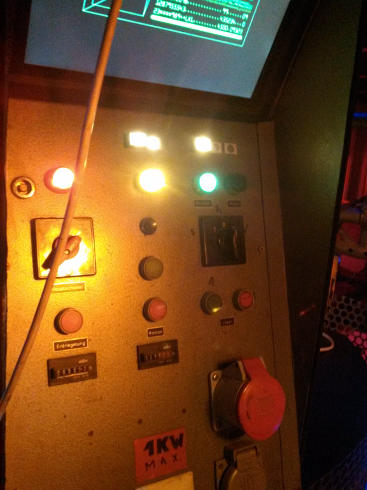

# HE1 Terminal Controller

Circuitboard and Firmware to control the LEDs and switches of the Terminal placed on HE-1 at c-base.
 

 
**TODO:**
 
 * Connect the switches
 * Find out how the second rotary switch works
 * MQTT implementation
